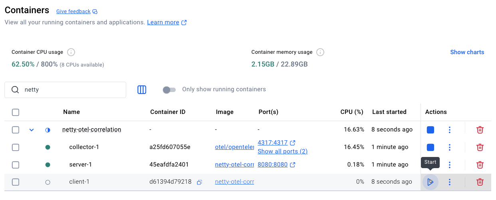
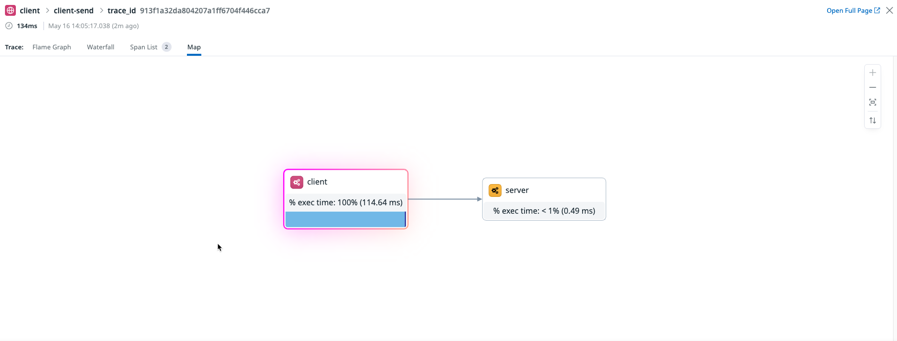
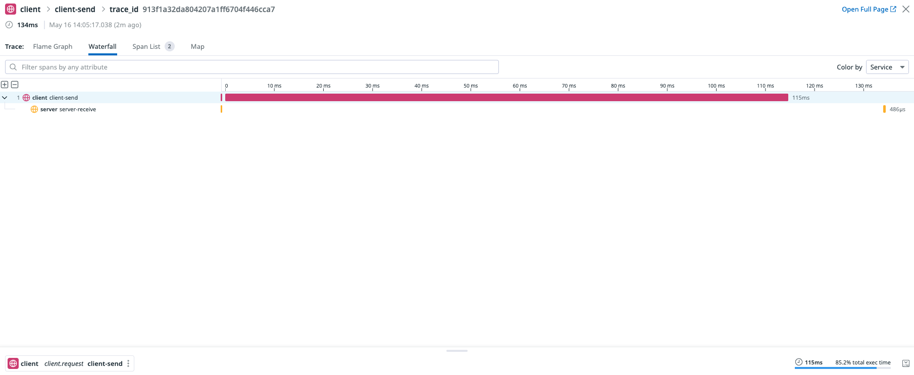
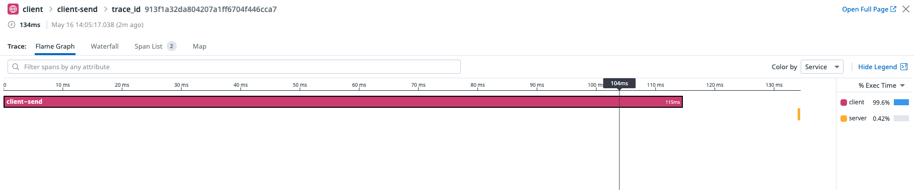
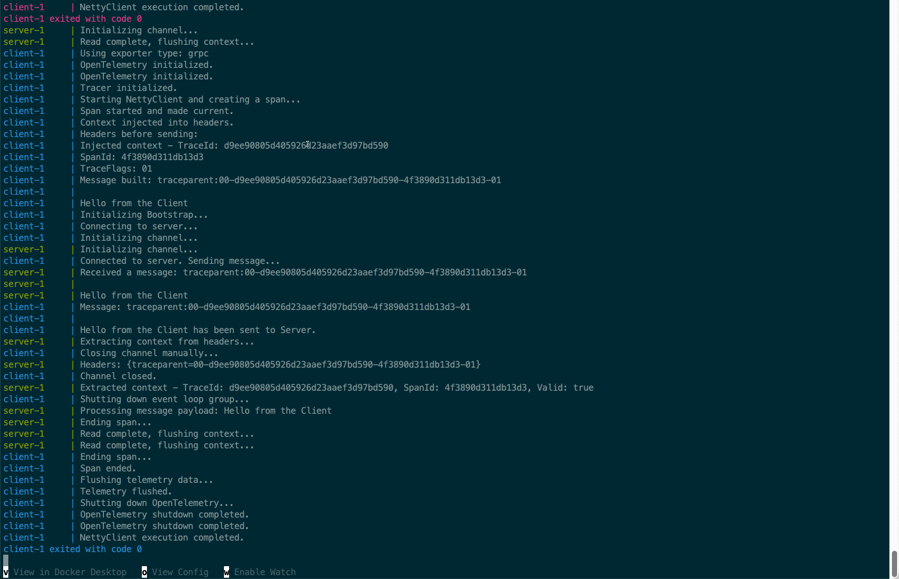

**Overall Functionality:**
This prototype demonstrates distributed tracing in a Netty-based client-server setup. The client sends messages to the server, and both sides create spans to trace the interaction. Context is fully propagated from client to server using message payload. Telemetry data is exported to Datadog via the OpenTelemetry Collector.

> **Disclaimer**: Modifying the message payload in the client or server might break the application logic. Ensure that any changes are thoroughly tested to avoid unexpected behavior.

**Setup:**

replace the API key in the .env file with a valid one before running

```bash
DD_API_KEY=your_api_key
```

run it with 

```bash
docker compose up --build
```


start again the client in another terminal at your convenience to send more messages from client to server 

```bash
docker compose run client
```

**Details:**

The provided code implements a distributed tracing system using OpenTelemetry with a Netty-based client-server architecture. Here's a summary of its components:

`OTelInitializer`

Initializes OpenTelemetry with either HTTP or gRPC exporters based on environment variables.
Configures a tracer provider, propagators (W3C Trace Context and Baggage), and a span processor.
Provides methods to initialize and shut down OpenTelemetry.

`NettyServer`

A Netty-based TCP server that listens on port 8080.
Processes incoming messages, extracts OpenTelemetry context from headers, and creates a server-side span for tracing.
Logs trace information and message payloads for debugging.

`NettyClient`

A Netty-based TCP client that connects to the server.
Creates a client-side span, injects OpenTelemetry context into headers, and sends a message to the server.
Logs trace information and handles server responses.

`ContextPropagatorHelper`

Provides helper methods to inject and extract OpenTelemetry context into/from a map of headers.
Ensures OpenTelemetry is initialized before performing context propagation.

`pom.xml`

Configures Maven dependencies for Netty, OpenTelemetry, and related libraries.
Includes a Maven Shade plugin to package the application into a single JAR file.

`otel-collector-config.yaml`

Configures the OpenTelemetry Collector to receive, process, and export telemetry data (traces, metrics, logs) to Datadog and debug exporters.
Includes receivers for OTLP, host metrics, Prometheus, and file logs.

`Dockerfile`

Builds the application using Maven and packages it into a Docker image.
Installs Netcat for health checks and runs the application JAR.

`docker-compose.yml`

Defines services for the OpenTelemetry Collector, server, and client.
Configures environment variables for OpenTelemetry exporters and propagators.
Ensures services wait for dependencies (e.g., Collector) to be ready before starting.

`.env`

Stores the Datadog API key required for exporting telemetry data.

`readme.md`

Provides instructions for setting up the environment, replacing the API key, and running the application using Docker Compose.

**Screenshots:**

Below are some screenshots demonstrating the application in action:

   

   

   

   

   